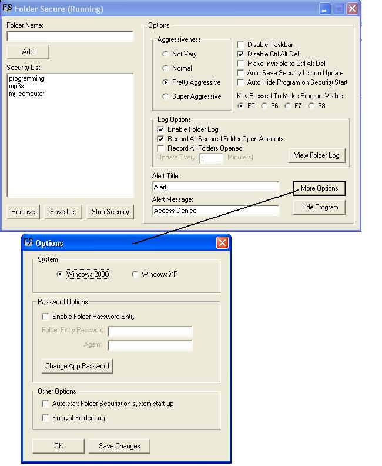



## \_Folder Secure\_

### Description

This code allows a user to add security to a folder by either making it password protected or not allowing access at all. It includes a simple method of encryption and decryption, shows how to creat a shortcut for your program's executable, shows methods to hide your pogram for the task manager (ctrl+alt+del), disable the task manager, and disable the taskbar or startmenu. It also includes a log which can be set to record all secured folders attempted to be opened or just any folders that are opened and includes time and date of when they are opened. Also includes a method of detecting when a key and what key has been pressed. And... yeah theres alot of stuff so enjoy and please vote!
 
### More Info
 

             |
---                |---
**Submitted On**   |2003-11-06 19:36:28
**By**             |[8BallPayer](https://github.com/Planet-Source-Code/PSCIndex/blob/master/ByAuthor/8ballpayer.md)
**Level**          |Advanced
**User Rating**    |3.7 (33 globes from 9 users)
**Compatibility**  |VB 5\.0, VB 6\.0
**Category**       |[Files/ File Controls/ Input/ Output](https://github.com/Planet-Source-Code/PSCIndex/blob/master/ByCategory/files-file-controls-input-output__1-3.md)
**World**          |[Visual Basic](https://github.com/Planet-Source-Code/PSCIndex/blob/master/ByWorld/visual-basic.md)
**Archive File**   |[\_Folder\_Se1668661162003\.zip](https://github.com/Planet-Source-Code/8ballpayer-folder-secure__1-49712/archive/master.zip)

